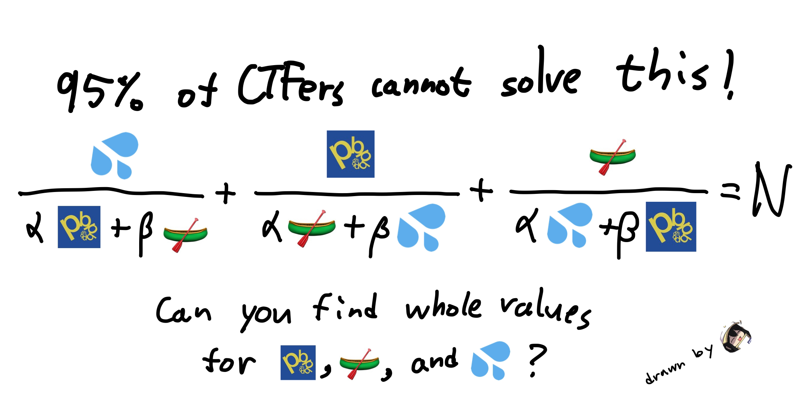

## Fruit Math

**Category**: Crypto

**Author**: rbtree

**Description**:

**Public Files**: `dist/chal.py`

**Solution**: Run `priv/solve.sage <HOST> <PORT>`.

**Notes**:

- Need to upload the image somewhere to put it on CTFd I believe